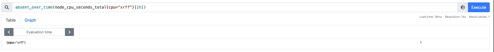

# PROMETHEUS

## Collecting Metrics on Prometheus
- One way is to use python or java built-in libraries in your application code to send the metrics to Prometheus but in all cases, we do not have access to the application code
* ## Infrastructure with lots of different components:
  - If millions of applications push metrics to Prometheus server, it can end up exhausting the server
  - So one possible solution is to have a bash scriptto collect the data from the database, run on s regular basis using a cron job, and send the information to Prometheus. However, it is not a good solution because it is not scalable
  - So a better solution is that Prometheus goes and pulls the data from these systems. In order to do so, we need to install `exporter` on or sometimes next to the system from where `Prometheus is supposed to pull the data`

  * ## Scraping
    - The process of connecting to an exporter and pulling the metrics into Prometheus is called `Scraping`
    - Scraping can be configured in Prometheus config file. The default is `15 seconds`

* ## An application that wants to send the metric to Prometheus
   - We need something called as `Push Gateway`
   - `Push Gateway` is a part of Prometheus which acts as a temporary storage where application can send the data
   - It has a `built-in exporter` so Prometheus can also scrape the information from a push gateway

> [!IMPORTANT]
> Prometheus is always a pull time-series database. You can never push anything to it. It always pulls.
 
## Types of Exporters
1. **Node Exporter:**
   - Every UNIX-based kernel eg: any computer using unix based OS is called a node
   - Node Exporter is an `official Prometheus exporter` for collecting metrics that are exposed by Unix-based kernels eg: Linux and Ubuntu
   - Example of metrics are CPU, Disk, Memory, & Network I/O
   - Can be extended with pluggable metric collectors
   - See [this](02_Node_Exporter_Installation.md) for instructions on how to install `node exporter` on your application server

2. **Windows Management Instrumentation:**
   - There is `no official Prometheus exporter for Windows`
   - WMI is infrastructure for data management and operations on Windows-based OS. It is a `part of Windows`
   - WMI is a `third-party Prometheus exporter` for Windows

## Prometheus Data Model
- Prometheus stores data as time series
- Every time series is identified by metric name and labels
- Labels are a key and value pair
- Time-series data format (key-value pairs are optional):

   ```shell
   <metric_name>{key=value, key=value,...}
   EG: auth_api_hit{count=1, time_taken=800}
   ```

## PromQL - Query for Prometheus
* ### Data Types:
  1. **Scalar:**
   - Can be float or string
     

  2. **Instant Vectors:**
   - These selectors allow the selection of a set of time series and a single sample value for each at a given timestamp (instant)
   - Only a metric name is specified -- no time range
   - Result can be filtered by providing labels or key-value pairs
     

  3. **Range Vectors:**
   - Similar to Instant Vectors except they select a range of samples
   - In order to apply the range, you have to apply a time range:
      ```shell
      label_name[time_spec]
      EG: auth_api_hit[5m] # Can't say -5m. It means past 5m by default
      ```
   - The values that can be used are (case-sensitive):
      

* ### Operators in PromQL
  1. **Arithmetic Operators:**
      
     
     

  2. **Comparison Operators:**
     
     

  3. **Set Binary Operators:**
     - Are case-sensitive
     - Can be only applied to `Instant Vectors`
       

  4. **Aggregation Operators:**
     - Aggregate the elements of a single Instant Vector
     - The result is a new Instant Vector with aggregated values
      
      
      

  5. **Matchers & Selectors in Prometheus:**
    

  6. **Time Offsets:**
     - Can be written after query to search data for that particular time period
      

      - Always applied after metric name:
   
        ```shell
         avg(prometheus_http_requests_total offset 10m) by (code)
        ```
* ### Functions
1. **absent(<Instant Vector>)**
   - Checks if an instant vector has any members
   - Returns an empty vector if parameter has elements
     

2. **absent_over_time<Range Vector>**
   - Checks if a range vector has any members
   - Returns an empty vector (`instant vector`) if parameter has elements
      

3. **abs(<Instant Vector>)**
   - Converts all values to their absolute value e.g., -5 to 5

4. **ceil(<Instant Vector>)**
   - Converts all values to their nearest larger integer e.g., 1.6 to 2

5. **fllor(<Instant Vector>)**
   - Converts all values to their nearest smallest integer e.g., 1.6 to 1

6. **clamp(<Instant Vector>, min, max)**
   - Lke trimming
   - Ignores any element in the vector which is smaller than the minimum value specified or larger than the maximum value specified

7. **clamp_min(<Instant Vector>, min)**
   - Ignores any element in the vector that is smaller than the minimum value specified

8. **clamp_max(<Instant Vector>, max)**
   - Ignores any element in the vector that is greater than the maximum value specified

9. **day_of_month(<Instant Vector>)**
   - For every UTC time returns day of month e.g., 1..31

10. **day_of_week(Instant Vector)**
    - For every UTC time returns day of week e.g., 1..7

11. **delta(<Instant Vector>)**
    - Can only be used with Gauges
    - Compares the first and the last item in the vector

12. **idelta(<Range Vector>)**
    - Can only be used with Gauges
    - Works same as delta but over time
       

13. **log2(<Instant Vector>)**
    - Returns binary logarithm of each scalar value

14. **log10(<Instant Vector>)**
    - Returns decimal logarithm of each scalar value

15. **ln(<Instant Vector>)**
    - Returns neutral logarithm of each scalar value

16. **sort(<Instant Vector>)**
    - Sorts elements in ascending order

17. **sort_desc(<Instant Vector>)**
    - Sorts elements in descending order

18. **time()**
    - Returns a near-current time stamp

19. **timestamp(<Instant Vector>)**
    - Returns the time stamp of each time series (element)

20. **avg_over_time(<Range Vector>)**
    - Returns the average of items in a range vector

21. **sum_over_time(<Range Vector>)**
    - Returns the sum of items in a range vector

22. **min_over_time(<Range Vector>)**
    - Returns the minimum of items in a range vector

23. **max_over_time(<Range Vector>)**
    - Returns the maximum of items in a range vector

24. **count_over_time(<Range Vector>)**
    - Returns the count of items in a range vector