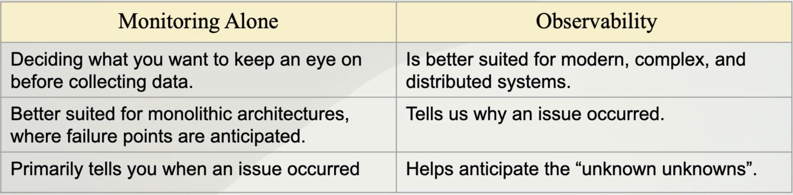

# Prometheus-Grafana-Opentelemetry
## FOUNDATIONS OF OBSERVABILITY
* ## Why are CI/CD & Microservices relevant to Observability?

  - Many services to monitor
  - Intra-service communications can fail
  - More vulnerable to security threats
  - More changes are deployed

  Therefore, we need to put in more effort in monitoring and observing the entire system.

## Monitoring
- Collecting & visualizing data about systems regularly so the system's health can be viewed and tracked
- 3 questions of monitoring:
   
   1. Is the service on? (eg: HTTP GET request)
   2. Is the service working as expected? (Eg: Collect Python errors if system was built using Python)
   3. Is the service performing well? (Eg: HTTP GET request time. 20000 req/sec)
- The data we collect for monitoring is called `Telemetry` data. It is used to find where the problem might be, not to diagnose the problem
- Metrics used to measure the DevOps success:
   1. Mean Time to Detection (MTTD):
      - The amount of time, on average, between the start of an issue and when teams become aware of it
    2. Mean Time to Resolve (MTTR):
       - The average time between when an issue is detected, and when systems are fixed and operating normally

## Monitoring Methods

- There are three main layers in the Microservices based application:
  
  1. UI Layer - website & mobile applications
  2. Service Layer - microservices like promotion service and payment services
  3. Infrastructure Layer - disk, memory. network, CPU
* #### Methods of collecting Metrics:
1. **RED Method (Request Oriented)** - `Contains metrics related to service layer and some parts of the UI layer`
   - Rate (throughput): Request per second
   - Errors: Failed requests i.e. HTTP 500
   - Duration: Latency or Transaction Response Time

2. **USE Method (Resource Oriented)** - `Contains metrics related to infrastructure layer`
     - Utilization: CPU Usage %. Disk Usage %
     - Saturation: Network queue length. Zero = Good
     - Errors: Disk write error. Zero = Good

3. **Four Golden Signal Methods (RED+S)** - `Contains metrics from Service layer and to some extent infrastructure layer`

   From Google SRE Handbook - 
`If you can only measure four metrics of user-facin system, focus on these four metrics`
    1. Latency
    2. Errors
    3. Traffic (Throughput)
    4. Saturation (Resources at 100 capacity)

4. **Core Web Vitals** - `Contains metrics from UI layer. Very important for Search Engine Optimization`
      - Largest Contentful Paint (Perceived page load)
      - First Input Delay (Perceived responsiveness)
      - Cumulative Layout Shift (Perceived stability)

## What is Observability?
- Monitoring is part of Observability
  
    - Observability not only tells us when and where the issue occured but also tells us why an issue occured
    - We do not need to know what we are going to monitor in advance. With the information that we collect through Observability, we can anticipate the problems that don't exist now but may arise later
 
## Types of Telemetry Data
`MELT`:

1. Metric:
   - Is an aggregated value representing events in a period of time
   - Great for comparing performance of the system with a time in the past
2. Event: 
   - An action that happened at a given time
   - Can be found in Event Streaming platforms like Kafka
   - Validates that an expected action happened
3. Log:
   - A very detailed representation of an event
4. Trace:
   - Shows the interactions of microservices to fulfill a request
   - Where your request has traveled

## Methods of Metric Collection
1. Push Method:
   - Applications & Microservices send the metrics to an endpoint given by the time-series database, via HTTP, TCP, or UDP
   - Eg: Your application sends metric to a network daemon to aggregate the metrics (in order to save CPU usage on the database) and then send it to the time-series database

2. Scrape Method:
   - Applications & Microservices provide APIs for the time-series database to read the metrics
   - Example of scrape method is Prometheus scraping metrics

## Reference:
https://gale.udemy.com/course/grafana-graphite-and-statsd-visualize-metrics